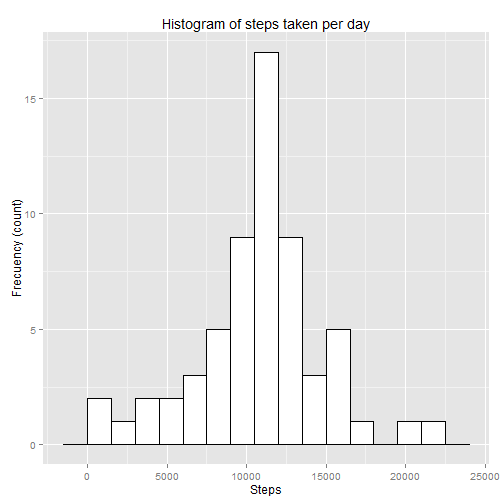
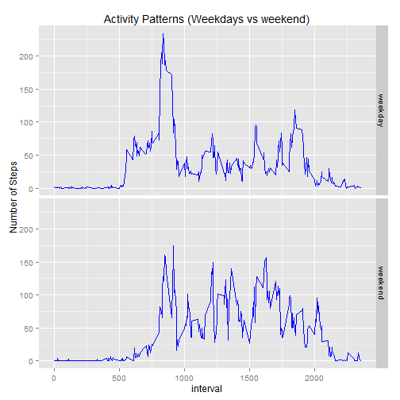

## Loading and preprocessing the data
The data file should be present in the current directory. It is readed and some preprocessing is done converting date strings to R date format.

```r
df      <- read.csv("activity.csv", header=TRUE)
df$date <- as.Date(df$date)
```
## What is mean total number of steps taken per day?
Here NA values are omitted. The script uses the dplyr package to summarize steps by date.
Finally the requested histogram is created using ggplot2 graphics.


```r
library(dplyr)
library(ggplot2)
dvalid <- na.omit(df)
byDay  <- group_by(dvalid, date)
byDay  <- summarise(byDay, Steps=sum(steps))
ggplot(byDay, aes(Steps))+ geom_histogram(binwidth=1000, fill="white", colour="black") +
    ggtitle("Histogram of steps taken per day") + ylab("Frequency (count)")
```

 

```r
medianByDate <- median(byDay$Steps)
meanByDate   <- mean(byDay$Steps)
sprintf("Median = %0.2f. Mean = %0.2f", medianByDate, meanByDate)
```

```
## [1] "Median = 10765.00. Mean = 10766.19"
```
Median of the total number of steps taken by day: **10765.00**    
Mean of the total number of steps taken by day: **10766.19** 

## What is the average daily activity pattern?
Computing the average of steps per interval and sorting them in decreasing order to find the top one. A plot is created with a vertical line at the interval with maximum number of steps.

```r
byInterval <- aggregate(dvalid$steps, by=list(interval=dvalid$interval), FUN=mean)
a         <- order(byInterval$x, decreasing=TRUE)
topInt    <- byInterval[a[1],"interval"]
abline(v=topInt, col="blue", lwd=2)
```

```
## Error in int_abline(a = a, b = b, h = h, v = v, untf = untf, ...): plot.new has not been called yet
```

```r
ggplot(data=byInterval, aes(x=interval, y=x), ) + geom_line(colour="blue") + 
    ylab("Mean number of steps") + ggtitle("Mean number of steps per interval (across all days)") +
    geom_vline(xintercept = topInt, col="red")
topInt    <- sprintf("%04s",as.character(topInt))
topIntStr <- paste(substring(topInt,1,2),":",substring(topInt,3,4), sep="")
avgSteps <- byInterval[a[1], "x"]
sprintf("5-minute interval maximum number of steps at %s (average of %f steps)", topIntStr, avgSteps)
```

```
## [1] "5-minute interval maximum number of steps at  8:35 (average of 206.169811 steps)"
```
Hence, the 5-minute interval that on average across all the days in the dataset, contains the maximum number of steps is at ** 8:35** (with average of **206.17** steps).

## Imputing missing values

The strategy for imputing missing values will be to assume the same number of steps that the mean of number of steps for the same 5-minute interval calculated considering the data without NA.

After computing the average steps per interval for data without NA the rows with NAs are identified and a new data set with only the non-complete cases is created filling the NA values with the estimate. 

A new dataset with both groups is created by binding both datasets.

Finally the histogram is plotted and the values of median and mean shown.


```r
sprintf("Total numer of rows with NAs: %d", sum(is.na(df)))
```

```
## [1] "Total numer of rows with NAs: 2304"
```

```r
avgByInt    <- aggregate(dvalid$steps, by=list(interval=dvalid$interval), FUN=mean)
rowsWithNA  <- !complete.cases(df)
dfWithNA    <- df[rowsWithNA,]
dfWithNA$steps <-sapply(dfWithNA$interval, function(x) {avgByInt[avgByInt$interval==x,"x"]})
completeDF  <- rbind(dvalid, dfWithNA)
row.names(completeDF) <- NULL
allByDay    <- group_by(completeDF, date)
allByDay    <- summarise(allByDay, Steps=sum(steps))
ggplot(allByDay, aes(Steps))+ geom_histogram(binwidth=1500, fill="white", colour="black") +
    ggtitle("Histogram of steps taken per day") + ylab("Frecuency (count)") 
```

 

```r
allMedian <- median(allByDay$Steps)
allMean   <- mean(allByDay$Steps)
sprintf("Median = %0.2f. Mean = %0.2f", allMedian, allMean)
```

```
## [1] "Median = 10766.19. Mean = 10766.19"
```
Median of the total number of steps taken by day: **10766.19**   
Mean of the total number of steps taken by day: **10766.19** 

### Impact of inputing missing data
Observe that only the median differs (and only by a little value) when we input missing data with estimate values.
This is just because the estimate has been chosen as the mean for the intervals (hence the mean is exactly the same in both cases). In global we can say that the impact of inputing missing data has been minimal.


## Are there differences in activity patterns between weekdays and weekends?


```r
library(lattice)
Sys.setlocale("LC_TIME", "English")  # Just to use English days of the week
```

```
## [1] "English_United States.1252"
```

```r
dfww <- dvalid
wd   <- ifelse(weekdays(dfww$date) %in% c('Saturday','Sunday'), "weekend", "weekday" )
dfww$weekwhat <- as.factor(wd)
byInterval <-aggregate(dfww$steps, by=list(interval=dfww$interval, weekwhat=dfww$weekwhat), FUN=mean)
ggplot(byInterval, aes(x=interval, y=x)) + geom_line(color="blue") + facet_grid(weekwhat~.) +
    ylab("Number of Steps") + ggtitle("Activity Patterns (Weekdays vs weekend)")
```

 

We can appreciate a different pattern between weekdays and weekends.  
Activity starts earlier and abruptly during weekdays (at about 05:30) compared to weekends when activity begins later growths more seventhly. Weekdays have a bigger peak at about 8:30 to 9:00 compared to weekends, but during the rest of the day weekdays are more "sedentarian" compared to weekends that have more intensity and a lot of peaks. 

