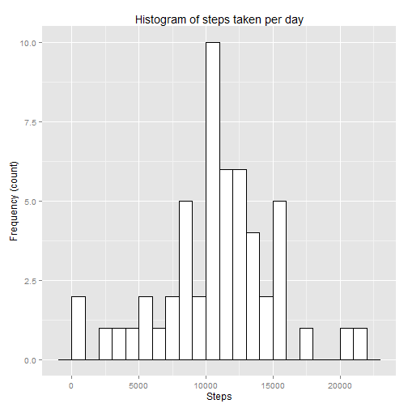
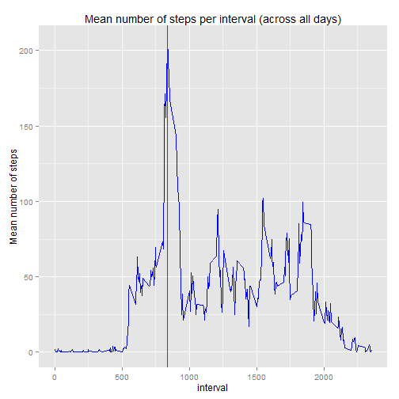

## Loading and preprocessing the data

```r
# Read the data and convert dates to proper type
df      <- read.csv("activity.csv", header=TRUE)
df$date <- as.Date(df$date)
```
## What is mean total number of steps taken per day?

```r
# Omit NA values, summarize steps by date and create and histogram
library(dplyr)
dvalid  <- na.omit(df)
byDate <- aggregate(dvalid$steps, by=list(date=dvalid$date), FUN=sum)
bins    <-seq(1, max(byDate$x), length=15)
hist(byDate$x, breaks= bins, xlab="Number of Steps", main="Histogram of steps taken per day")
```

 

```r
# Print the median and the mean of steps taken per day
sprintf("Median of steps per day = %0.2f", median(byDate$x))
```

```
## [1] "Median of steps per day = 10765.00"
```

```r
sprintf("Mean of steps per day = %0.2f", mean(byDate$x))
```

```
## [1] "Mean of steps per day = 10766.19"
```

## What is the average daily activity pattern?

```r
# Calculate average of steps per interval across all dates and plot
byInterval <-aggregate(dvalid$steps, by=list(interval=dvalid$interval), FUN=mean)
plot(byInterval$interval, byInterval$x, type="l", main="Mean number of steps per interval (across all days)", xlab="Interval", ylab="Mean number of steps")
```

 

```r
# Order the intervals in decreasing order and take the first one
a <-order(byInterval$x, decreasing=TRUE)
topInt   <- byInterval[a[1],"interval"]
avgSteps <- byInterval[a[1], "x"]
sprintf("5-minute interval with maximum numer of steps: %d (with average of %f steps)", topInt, avgSteps)
```

```
## [1] "5-minute interval with maximum numer of steps: 835 (with average of 206.169811 steps)"
```


## Imputing missing values

The strategy for imputing missing values will be to assume the same number of steps that the mean of number of steps for the same 5-minute interval calculated considering the valid data.


```r
# First show the number of rows with NAs
sprintf("Total numer of rows with NAs: %d", sum(is.na(df)))
```

```
## [1] "Total numer of rows with NAs: 2304"
```

```r
# Calculate the average steps per interval (considering valid cases cases)
avgByInt    <- aggregate(dvalid$steps, by=list(interval=dvalid$interval), FUN=mean)
# Identify rows with NAs
rowsWithNA  <- !complete.cases(df)
# Creation of a new dataframe with only the non-complete cases
dfWithNA    <- df[rowsWithNA,]
# Fill the NA values with an estimate 
dfWithNA$steps <-sapply(dfWithNA$interval, function(x) {avgByInt[avgByInt$interval==x,"x"]})
# Creation of a new dataset with missing data filled in
completeDF <- rbind(dvalid, dfWithNA)
row.names(completeDF) <- NULL
completeByDate <- aggregate(completeDF$steps, by=list(date=completeDF$date), FUN=sum)
bins    <-seq(1, max(completeByDate$x), length=15)
hist(completeByDate$x, breaks= bins, xlab="Number of Steps", main="Histogram of steps taken per day")
```

 

```r
# Print the median and the mean of steps taken per day
sprintf("Median of steps per day = %0.2f", median(completeByDate$x))
```

```
## [1] "Median of steps per day = 10766.19"
```

```r
sprintf("Mean of steps per day = %0.2f", mean(completeByDate$x))
```

```
## [1] "Mean of steps per day = 10766.19"
```
### Impact of inputing missing data
Observe that only the median differs (and only by a little value) when we input missing data with estimate values.
This is just because the estimate has been chosen as the mean for the intervals (hence the mean is exactly the same in both cases).

In global we can say that the impact of inputing missing data has been minimal.
## Are there differences in activity patterns between weekdays and weekends?
